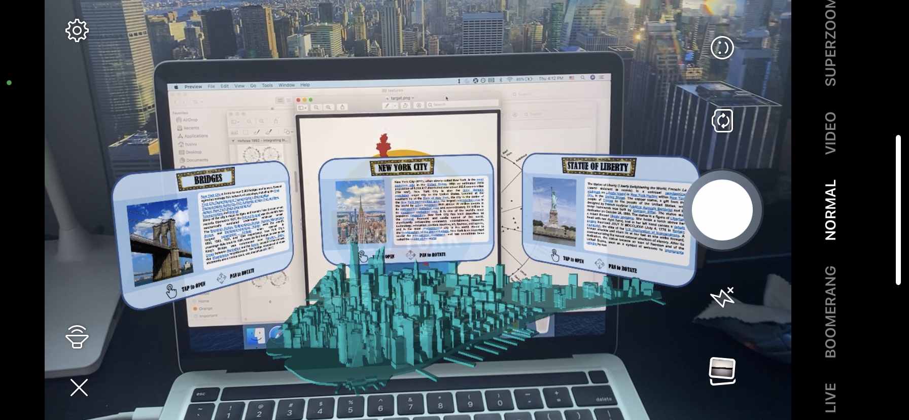
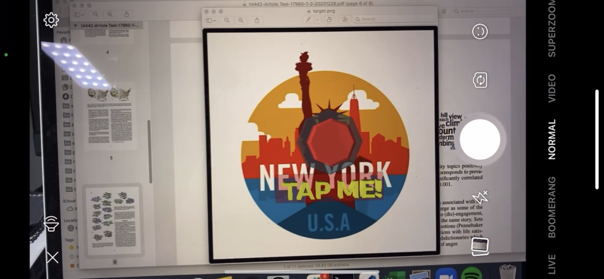
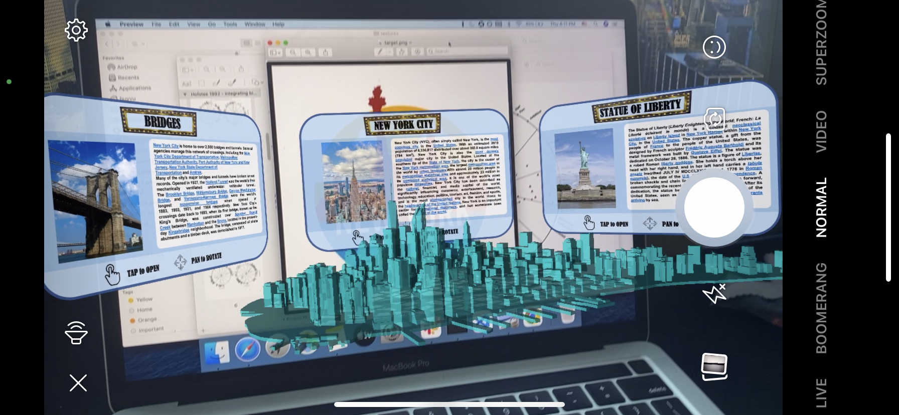
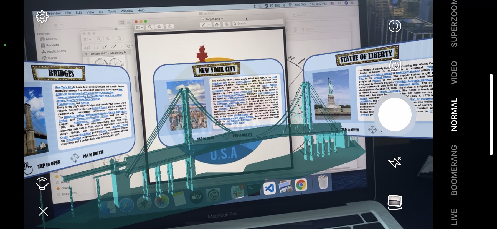

# AR Pamphlet of New York City
My interface design for a pamphlet introducing NYC (my beloved city) and its popular sites. The folding pamphlet opens up after hitting the button, expanding into three virtual monitors introducing different sites in NYC and its information. For each site, a floating, slowly rotating holograms will be projected in front of the screen, which can be control, resize with our fingers. I hope to achieve a cool-looking, captivating animations to sustain viewers' attention and interests. 

P/s: When watching, remember to turn on the volume.

  

The experience starts when user head the phone to the following target image:

  

Check out the demo video here (https://youtu.be/nzO9tnHqkmA) and some snapshots of the experience:

  
  
  
  
    

